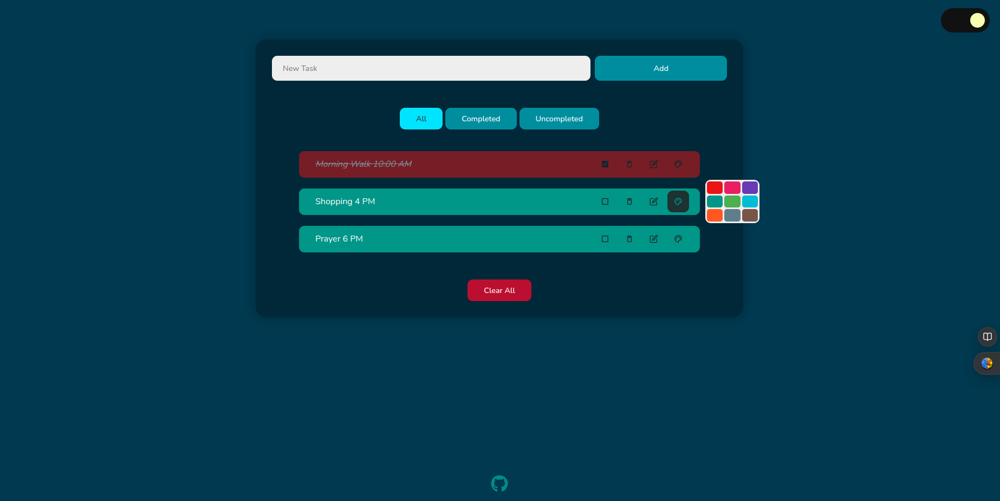

# [React Todo App](https://todo-one-gilt.vercel.app/)
A minimalistic, customisable todo app.

## Features

- Dark mode
- Drag n drop tasks to reorder them
- Tasks saved locally
- Customisable task color
- Edit task
- Notification Box
- Tablet & mobile friendly

## Built with

- React Js, Css, Sass
- React Hooks : useState, useEffect, useRef, useContext
- react-beautiful-dnd, react-icons, uuidv4...

## Available Scripts

In the project directory, you can run:
### `npm install`

Install all required packages

### `npm start`

Runs the app in the development mode.\
Open [http://localhost:3000](http://localhost:3000) to view it in your browser.

# My Project

## Home page:

